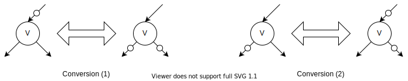

## Document of Final Project

Shanqing Lin 
Github ID: Xusine1131
Project: Extended BDD Package

#### More Variables Support in Truth Table

1. Replace internal data structure `uint64_t` to `std::vector<bool>` so that more than 6 variables are supported.
2. Update all the binary operands functions accordingly and remove all the constant tables.
3. Rewrite the functions of positive cofactor, negative cofactor, and the constructor which takes variable as parameter.

#### Computed Cache

1. Look up before recursively calling the function. Return the result directly if hit, or call the function if miss.
2. Update before function returns its value. Update policies are:
  - Record the original result (operand-result pair)
  - Record derivative results (after applying not on each operands)
    - For AND and OR, following De-Morgan's law
    - For XOR, $\overline{A} \oplus B = \overline{A \oplus B}$ 
    - For ITE, swap the T and E if I is inverted.

#### Complement Node

1. Add struct `NodeReference` to present a function, and its index is named `value_t`. Similar to `Node`, there is a unique function to make sure that each node only has one positive reference and negative reference.

2. Leverage the following conversion(1) to reuse existing code if the input value is a negative reference.
3. If the Then branch is a negative, use conversion (2) to make it normal.

#### Reference and Dereference

- Add reference number to each node to record its reference time.
- When calling a reference over a `NodeReference`, increase the reference time of the node it points to unless it's the constant node (1).
- When deferencing a node, decrease the reference number by 1. After that if the node is a dead node, dereference its children.

